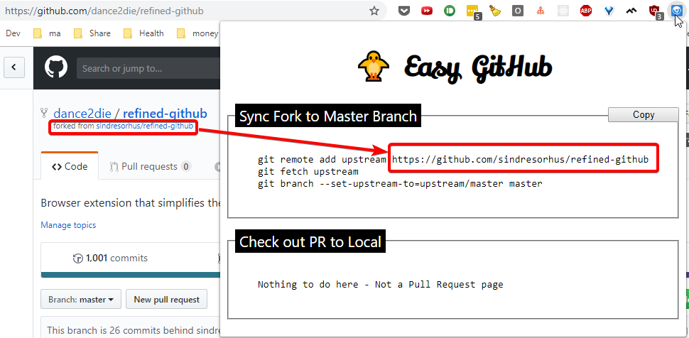

# easy-github

Make GitHub interaction easier with `easy-github` chrome extension~~

# Demos

## Code Snippet for synchronizing a forked repository

## Code Snippet for downloading a Pull Request code to local

# Planned

1. Add a code snippet to set upstream to the master
1. Add a code snippet to download PR to local