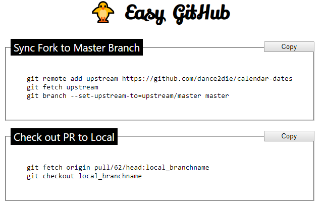

# easy-github

Make GitHub interaction easier with `easy-github` chrome extension~~

Available on [Chrome Web Store](https://chrome.google.com/webstore/detail/easy-github/gjeknhliambaadchnegjbpfpehhajdfg).

# Demos

## Code Snippet for synchronizing a forked repository

## Code Snippet for downloading a Pull Request code to local

## Global screenshot

